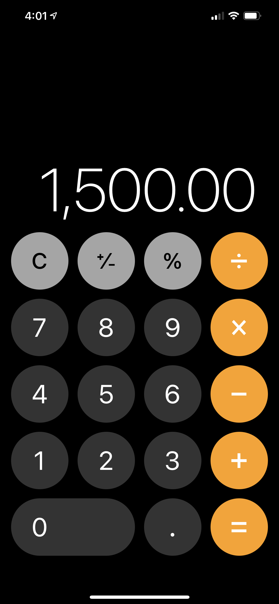

# React native IOS calculator app 

> React Native

> Typescript

> CI/CD

Descripción del proyecto : Calculadora básica IOS



## Tabla de contenido

- [Comenzando](#comenzando)
    - [Prerrequisitos](#prerrequisitos)
    - [Instalación](#instalación)
    - [Desarrollo](#desarrollo)
- [Pruebas](#pruebas)
    - [Test](#test)
- [Documentación](#documentación)
    - [Estructura](#estructura)
    - [Conceptos](#conceptos)
- [Equipo](#equipo)

## Comenzando

A continuación se listarán todos los puntos necesarios para comenzar a desarrollar con el proyecto actual desde su fase de instalación hasta levantar un ambiente local de desarrollo sin problemas, se incluirán instrucciones de ejecución de comandos, testing, reglas y contexto de como esta estructurado el proyecto incluyendo su estructura de carpetas junto con su descripción.

## Prerrequisitos

1. Node js
    * https://nodejs.org/es/download/
2. Yarn
    * https://classic.yarnpkg.com/en/docs/install/#windows-stable
3. Entorno react native configurado
    * https://reactnative.dev/docs/environment-setup

* **Recuerda configurar tus llaves ssh**
    * https://docs.gitlab.com/ee/ssh/
    * https://docs.github.com/es/free-pro-team@latest/github/authenticating-to-github/adding-a-new-ssh-key-to-your-github-account

## Instalación

```bash
$ yarn install
```

## Desarrollo

Ejecutar `yarn run android` o `yarn run ios` para levantar dispositivos. Se abrirá el dispositivo configurado según las necesidades.

```bash
$ yarn run android
```

```bash
$ yarn run ios
```

* Posteriormente ejecutar `npx react-native start --reset-cache` para un servidor de desarrollo.

```bash
npx react-native start --reset-cache
```

## Pruebas

Las pruebas son necesarias para la construcción de nuevas funcionalidades dentro del proyecto, estas pruebas están ligadas a un ciclo de vida de CI/CD que se ejecutará al subir un nuevo cambio en las ramas, se aconseja ejecutar pruebas unitarias o de integración antes de subir una nueva funcionalidad al repositorio, esto es importante para evitar posibles errores en el futuro.

## Test

Ejecuta `yarn run test` para ejecutar las pruebas de todo el proyecto.

```bash
$ yarn run test
```

## Documentación

A continuación se realizará una arquitectura establecida para los proyectos  junto a su convención de nombres y conceptos de ferencia. Arquitecturas recomendadas por el equipo de Agilesoft.

## Estructura

* Ideal para proyectos pequeños medianos
* Se basa en la separación por contexto

**Nota**: Toda la documentación para formar el repositorio actual se basa en la documentación oficial de React junto con sus buenas prácticas.

* Referencias
    * https://es.reactjs.org/docs/faq-structure.html

```bash
|-- src
    |-- [+] services
        |-- AuthService.ts
        |-- UserService.ts
        |-- EmployerService.ts

    |-- [+] components
        |-- AppBar.tsx
        |-- AppFooter.tsx
        |-- AppHeader.tsx

    |-- [+] Screens
        |-- EmployerListScreen.tsx
        |-- EmployerCreateScreen.tsx
        |-- HomeScreen.tsx

    |-- [+] models
        |-- Employer.ts
        |-- User.ts

|-- package.json
|-- index.js
|-- App.tsx
```

## Conceptos

* **Components**
   + Pieza de software personalizado y reutilizable compuesto por
        * Una Vista
        * Lógica

* **Services**
    + Mecanismo para compartir funcionalidad entre componentes
    + Comúnmente consumen datos de una fuente externa

* **Screens**
    + Agrupación de pantallas generales

* **Models**
    + Estructura que representa en estricto rigor a una representación de un objeto del modelo de negocio

## Equipo

Desarrollado por Diego Cortés

* dcortes.net@gmail.com
